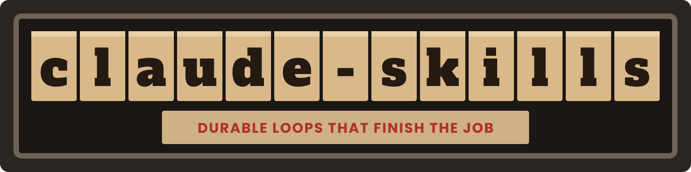
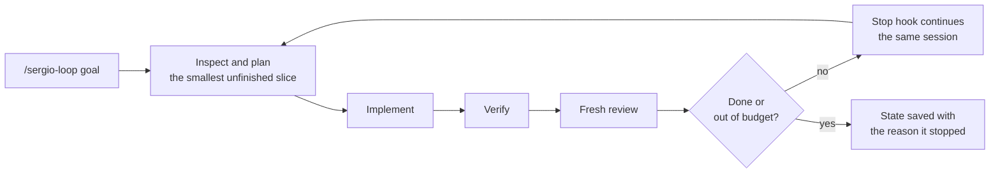

---
hide:
  - navigation
---

# agent-skills { .as-visually-hidden }

<p align="center">
  
</p>

<p align="center">
  <a href="https://github.com/GeiserX/agent-skills/stargazers"></a>
  <a href="https://github.com/GeiserX/agent-skills/releases"></a>
  <a href="https://github.com/GeiserX/agent-skills/blob/main/LICENSE"></a>
</p>

---

**agent-skills** is a set of skills for [Claude Code](https://claude.com/claude-code) and [Codex](https://developers.openai.com/codex). Left alone, an agent works until its turn ends and then reviews its own change. The goal loop keeps its state outside the session, so it picks up where it stopped, and a fresh reviewer checks each slice before the next one starts. The parallel skills put several independent agents on one bug, pull request, codebase or question, and keep only the findings that hold up against the code. Other skills grow a repository, file pull requests, draft replies, recover cut-off work and explain. Start with [Getting started](getting-started.md), then [Usage](usage.md).

<div class="grid cards" markdown>

-   :material-download: **[Getting started](getting-started.md)**

    ---

    Link the skills into Claude Code or Codex, install the Stop hook, and add its two `settings.json` entries.

-   :material-refresh: **[Your first goal loop](usage.md#how-to-use-the-goal-loop)**

    ---

    Open a fresh session in a repository, run `/sergio-loop <goal>`, and resume it after a stop.

-   :material-account-group: **[Parallel skills](usage.md#parallel-skills)**

    ---

    Investigate, review a pull request, audit a codebase, research a question or make a change, with a panel sized to the task.

-   :material-book-search-outline: **[Knowledge-base skills](usage.md#knowledge-base-skills)**

    ---

    Fill in one adapter file, then ask `/kb-research` or `/kb-review` against your team's own record.

</div>

## The skills

| Skill | What it does |
|---|---|
| [`sergio-loop`](usage.md#goal-loop-sergio-loop) | Drives one repository toward a goal, one small slice at a time, and resumes after a stop. |
| [`refine-loop`](usage.md#refine-loop) | Makes one small improvement per round that keeps behavior the same, ranked by ROI and checked by a fresh reviewer. |
| [`docs-loop`](usage.md#docs-loop) | Audits documentation against the default branch: a dry run, staged edits, or one pull request per repository. |
| [`investigate`](usage.md#parallel-skills) | Reproduces a failure and tests competing hypotheses until one root cause holds. |
| [`review-pr`](usage.md#parallel-skills) | Reviews a pull request from several angles, fixes the valid findings, and stops after three rounds. |
| [`review-code`](usage.md#parallel-skills) | Audits a repository in waves and publishes every verified finding, ranked by severity. |
| [`research`](usage.md#parallel-skills) | Answers a question from the code, its history and primary sources, with a source for each claim. |
| [`implement`](usage.md#parallel-skills) | Makes the smallest complete change, giving each parallel writer its own files. |
| [`kb-research`](usage.md#knowledge-base-skills) | Answers from your team's record, read-only, each claim with the anchor it was read from. |
| [`kb-review`](usage.md#knowledge-base-skills) | Reviews a pull request with the learnings your reviewers recorded, and reports only. |
| [`grow-my-repo`](usage.md#growing-a-repository) | Plans where an open-source repository gets listed and does the submissions an agent may do. |
| [`submit-awesome`](usage.md#growing-a-repository) | Sends one entry to each fitting awesome list, by that list's own rules. |
| [`file-pr`](usage.md#pull-requests-and-replies) | Opens a pull request whose title says why the change matters and whose body starts with the problem. |
| [`verified-reply`](usage.md#pull-requests-and-replies) | Drafts a reply you send as yourself, with every claim checked against a live source. |
| [`revive`](usage.md#reviving-cut-off-work) | Brings work cut off by a limit, a crash or a compaction back from its real edge, without doing anything twice. |
| [`eli5`](usage.md#explaining-and-deciding) | Explains work, a system or a situation in plain words with real names. |
| [`help-decide`](usage.md#explaining-and-deciding) | Lays a decision out so one word answers it: recommendation and pros and cons first. |

## What you type

In Claude Code a skill is `/<name>`; in Codex it is `$<name>`. These are the examples from [Usage](usage.md):

```text
/sergio-loop --coordinate --max-iterations=20 <goal>
/refine-loop theta=1.5 focus=usability,refactoring <intent>
/docs-loop --apply REPO_PATH ...
/investigate Checkout returns 500 since yesterday's deploy
/review-pr 42
/research How does connection pooling work in this app?
/kb-research Did we decide to drop the retry budget?
/grow-my-repo owner/repo
/revive
```

## How the goal loop runs



- The goal is stored word for word in `docs/GOAL.md`, the evidence in `docs/AUTOPILOT-WORKLOG.md`, and the decisions only a person can make in `docs/DEFERRED-QUESTIONS.md`. The state the loop resumes from lives in `.omc/sergio-loop/`.
- In Claude Code the Stop hook continues the same session for up to eight consecutive stops, Claude Code's own limit. After that, `/sergio-loop` with no goal resumes. The hook does nothing in a repository without an active loop and ignores other sessions.
- In Codex there is no Stop hook: each call runs one pass, saves the state and says how to resume.
- A run ends after 50 iterations by default (`--max-iterations` changes it), or after three iterations without progress or three failures.

## What the skills do not do

- None of them treats a stored goal or an earlier approval as permission to merge, publish or deploy. That needs your word in the current session.
- `/docs-loop` and `/review-pr` never merge. `/kb-review` and `/verified-reply` post nothing unless you approve the exact text.
- `/grow-my-repo` and `/submit-awesome` never star, vote, or answer a question about how something was made on your behalf. Where a place wants a human, they hand you a packet.
- The parallel skills, the knowledge-base skills, `grow-my-repo` and `submit-awesome` never start on their own; the model can only run them when you name them. The loops' descriptions tell the model the same.
- The knowledge-base skills bring no knowledge base. You describe yours in `references/knowledge-base.md`, and they stop and ask while it still has placeholders.
- The installer links only this repository's own skills. The skills from other projects under `vendor/` are listed on [Related projects](related.md).

## How the repository is laid out

- `skills/` holds the Claude Code skills. `codex/skills/` is generated from them by `scripts/build_codex.py`, and the tests fail when it is stale.
- `runtime/` holds the Stop hook and the state it reads. `shared/loop-contract.md` holds the rules every loop must keep, and `scripts/validate_skills.py` checks each skill against them. See [Development](development.md).
- Your own additions, such as private workspace policy, belong in your installed copies, never in this repository. See [Canonical sources and local overlays](getting-started.md#canonical-sources-and-local-overlays).

## Getting help

- Something broken: open an [issue](https://github.com/GeiserX/agent-skills/issues) with the skill, whether it ran in Claude Code or Codex, the version, and what it printed.
- A security problem: follow the [security policy](https://github.com/GeiserX/agent-skills/blob/main/SECURITY.md), never a public issue.
- Validating a skill, rebuilding the Codex copies and running the tests: [Development](development.md). The skills from other projects kept here, and the repository this one replaced: [Related projects](related.md).

## License

agent-skills is released under the [GPL-3.0-or-later](https://github.com/GeiserX/agent-skills/blob/main/LICENSE) license. The skills under `vendor/` keep their own MIT licences.
